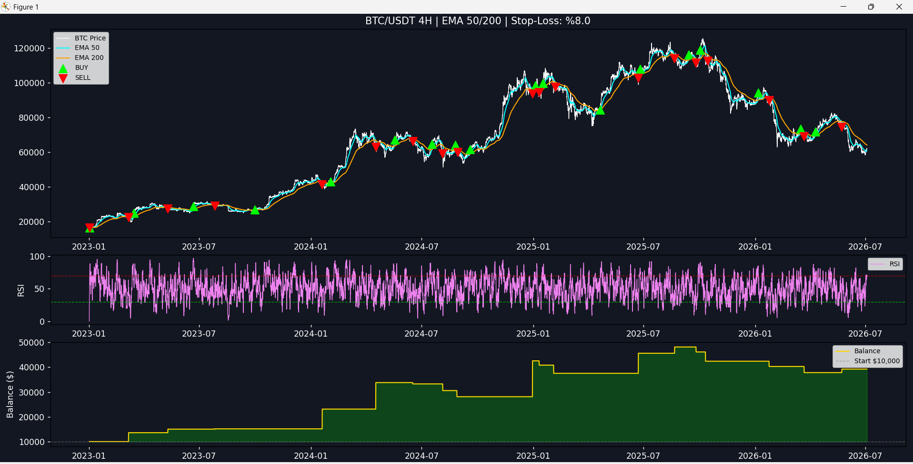
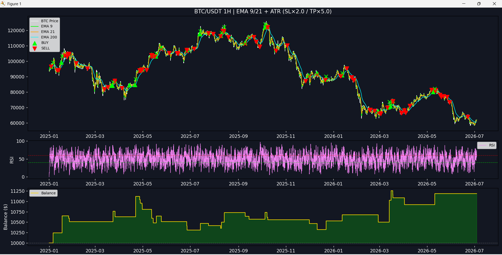
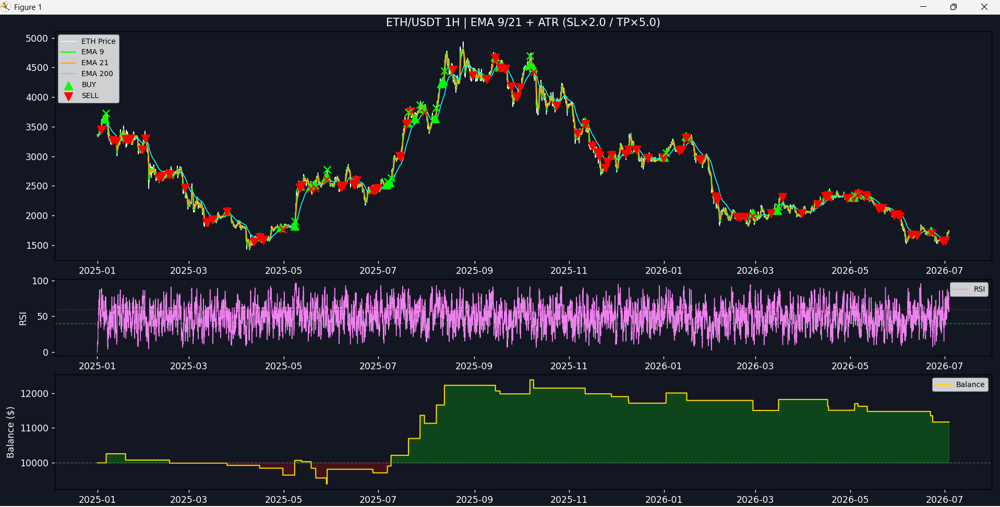
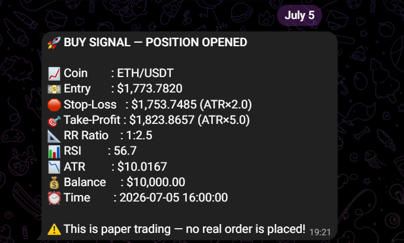
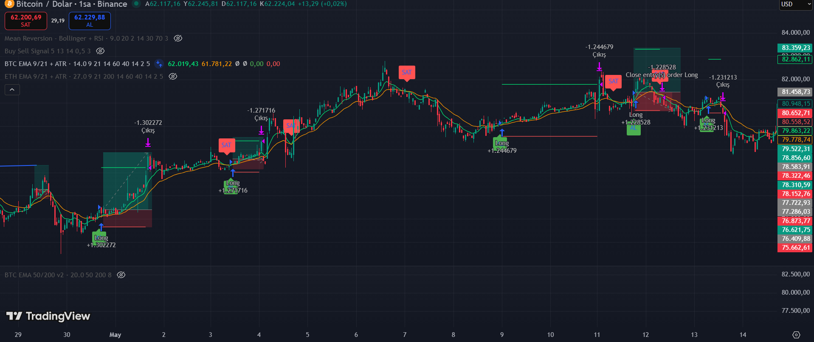

# Crypto Trading Signal Bot

A multi-strategy crypto trading signal system for Binance, built with Python. Combines TradingView Pine Script prototyping, historical backtesting, and live paper-trading bots with Telegram alerts.

> ⚠️ All bots run in **paper trading mode** — no real orders are placed. Educational/portfolio project, not financial advice.

---

## Overview

Three bots run 24/7 on a Hetzner VPS, each testing a different EMA-based strategy:

| Bot | Symbol | Strategy | Timeframe |
|---|---|---|---|
| `btc_ema50_200_bot.py` | BTC/USDT | EMA 50/200 crossover (trend-following) | 4h |
| `btc_ema9_21_atr_bot.py` | BTC/USDT | EMA 9/21 crossover + ATR stop/target | 1h |
| `eth_ema9_21_atr_bot.py` | ETH/USDT | EMA 9/21 crossover + ATR stop/target | 1h |

**Pipeline:** prototype in Pine Script → backtest with real Binance data (Python + ccxt) → deploy as a live bot with Telegram alerts + SQLite logging.
Binance API → Python signal engine (EMA/RSI/ATR) → Telegram alert + SQLite log
→ position monitored every 30s (SL/TP)
---
## Strategies & Backtest Results

**EMA 50/200 (BTC, 4h)** — long-term trend-following, 8% fixed stop, no fixed target (rides the trend).
📈 **+278% return** · 47% win rate · 17 trades · Jan 2023–Apr 2026



**EMA 9/21 + ATR (BTC, 1h)** — momentum entries with volatility-adaptive exits (SL = ATR×2, TP = ATR×5, RR 1:2.5).
📈 **+11.9% return** · 36% win rate · 39 trades · Jan 2025–Jul 2026



**EMA 9/21 + ATR (ETH, 1h)** — same logic applied to ETH.
📈 **+15.1% return** · 35% win rate · 34 trades · Jan 2025–Apr 2026



Both ATR strategies have a low win rate but stay profitable because winners are much bigger than losers — the reward-to-risk ratio does the work.

---

## Live Paper Trading

Each bot fetches fresh data every few minutes, checks entries/exits, monitors open positions every 30s, and sends a Telegram alert on every entry/exit/breakeven event. Every closed trade is logged to SQLite.



```bash
cd analysis
python db_analysis.py   # view trade history & performance by bot
```

---

## TradingView Prototyping

Strategies are first prototyped in Pine Script for fast visual iteration and built-in Strategy Tester backtesting before being ported to Python.



## Project Structure

```
crypto-bot/
├── bots/           # Live paper-trading bots (run on VPS)
├── backtest/       # Historical backtesting scripts
├── analysis/       # SQLite query / reporting tools
├── data/           # trades.db (git-ignored)
├── .env            # Telegram credentials (git-ignored)
├── requirements.txt
└── README.md
```

## Setup

```bash
git clone https://github.com/YOUR_USERNAME/crypto-bot.git
cd crypto-bot
pip install -r requirements.txt
```

Create a `.env` file: 
TELEGRAM_TOKEN=your_bot_token_here
TELEGRAM_CHAT_ID=your_chat_id_here
(Get a token from [@BotFather](https://t.me/BotFather), then find your chat ID via `https://api.telegram.org/bot<TOKEN>/getUpdates`)

Run a backtest:
```bash
cd backtest && python btc_ema9_21_atr_backtest.py
```

Run a live bot:
```bash
cd bots && python btc_ema9_21_atr_bot.py
```

For 24/7 uptime, deploy to a small VPS and run inside `screen`:
```bash
screen -S bot1
python3 btc_ema9_21_atr_bot.py   # Ctrl+A then D to detach
```

---

## Tech Stack

Python · ccxt · pandas · matplotlib · SQLite · python-dotenv · Telegram Bot API · TradingView Pine Script · Hetzner Cloud (Ubuntu 24.04)

---

## Roadmap

- [ ] ADX filter to avoid choppy/low-volatility conditions
- [ ] More pairs (SOL, BNB)
- [ ] Web dashboard for live performance
- [ ] Optional live trading mode after a longer paper-trading track record

---

## License

MIT